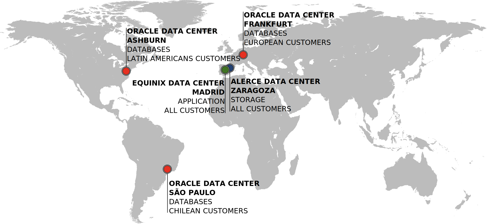

There are Data Centers in three main regions depending on the customer´s location and overall use. In Spain, the main data center is hosted in Equinix in Madrid whereas another data center in Zaragoza serves as storage for VM backups/snapshots. In Frankfurt Germany, there is a GoldenGate replica with an approximate delay of one minute. The data center in Ashburn US serves LATAM customers whereas as the one in São Paulo serves Chilean customers.

