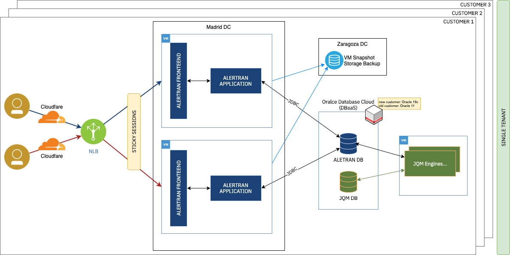

The infrastructure architecture consists of a security layer with Cloudfare, a Network Load Balancer that balances loads through sticky sessions and directs it to one of the two VMs in the Madrid data center, which are backed up with snapshots stored in the Zaragoza data center. The application layer reads/writes an Oracle Database (HA-managed by Oracle) using a JDBC connection. On the other hand, there is a JQM located on another machine and responsible of asynchronous jobs for periodic heavy tasks/batches, such as billing, pricing reporting, etc. It directly attacks the application Database by executing Java classes that call on the corresponding PL/SQL, with the ability to make data modifications.

