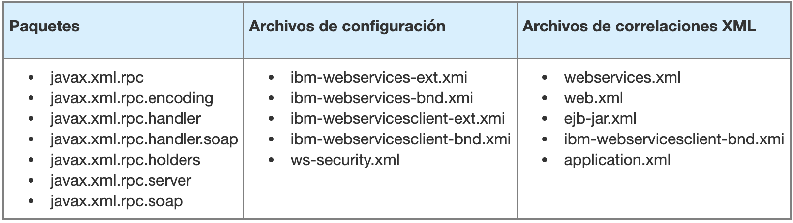
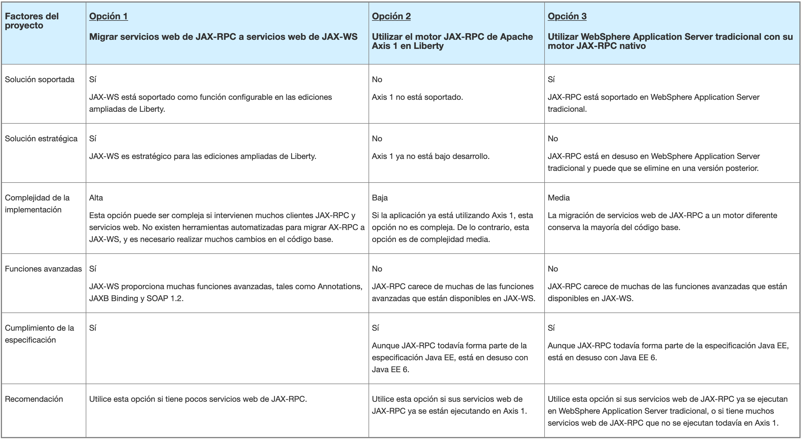

<!-- ### 3.1.1 Serious problems -->

#### Migrate JBoss login modules

This rule points at the elements `<security-domain>` contained in the jboss-web.xml file and the elements `<login-config>` contained in the web.xml  file to let you know that you have to configure the security for the application.

To protect the application you can add users and groups that you need into the predetermined users register and assign them roles. In Liberty, the users registry can be configured by defining an element basicRegistry in the server.xml file.
As an alternative, a file based registry can be configured, an LDAP registry or a personalised registry. Moreover, security settings can be configured for your working environment by creating security domains.

The application can use JAAS login modules. If a login module is being used, the name of the class is defined in the jboss-web.xml file by an element `<valve>` inside an element `<security-domain>` or in the conf/login-config.xml file by an element called `<login-config>`. If a JBoss Application Server login module or a specific APIs are being used, the WAS Application server modules should be replaced and configured again.

#### Do not use JBoss specific name search strings

This rule marks the usage of a series of names searches of JBOSS owners who starts by the name of `java`. This also includes `java:jboss, java:jdbcy, java: or java:/` given that 
the following content Jboss specific values.

For example look at the following lines:

* ds = (DataSource) ctx.lookup("java:" + getLookupName());
* ds = (DataSource) ctx.lookup("java:jboss/Test");
* ds = (DataSource) ctx.lookup("java:global");

The rule marks `java:" and "java:jboss/Test", except for "java:global"`. Even though the rule marks the `java` serie, we might not need to migrate it. In the example above let's check
the return value of getLookupName() to determine if the search name should change. If the returned name it is a reference defined in the name space `java:comp/env` you could simply eliminate the `java` serie.

#### Use WebSphere Bindings to define resource reference names

The JBoss deployment descriptors, `jboss-web.xml` and the `jboss.xml` file, can contain references to resources. These references map the resource reference to the JNDI name, as demonstrated in the example. For references to work properly in WebSphere(R) Application Server, they must be passed to the WebSphere Application Server bind files.

As defined in the JBoss DTD, the `<resource-ref>` tag can contain three different tags after the `<res-ref-name>` tag:

* resource-name
* jndi-name
* res-url

#### Use WebSphere extensions to define the context root of the web module

For stand-alone web module files, the application context root can be specified in the JBoss deployment descriptor, `jboss-web.xml`. This rule detects the presence of the `<context-root>` element in the `jboss-web.xml` file. In source explorer, the quick fix applies this value to the Liberty or traditional WebSphere extension file.

Looking at the business applications archives, the context root's information of the deployment descriptor `application.xml` for the EAR archive is preferred to the context root of the deployment descriptor for the web module. 
This quick solution copies the context root's information although its value it is not used.

#### The Java API for XML-based RPC (JAX-RPC) is not available

This rule flags the use of JAX-RPC-specific configuration files and packages. This rule will also mark the use of the jaxrpc-mapping-file tag in XML mapping files. The following table lists the Java packages, configuration files, and XML mapping files affected by this rule:



The Java API for XML-based RPC (JAX-RPC) is not supported on Liberty or Liberty Core.

The table below compares the three options according to factors that could affect the project.



##### Use the Apache Axis 1 JAX-RPC engine in Liberty

If you already use Axis 1, to use it in Liberty you must include the Axis 1 libraries in the Liberty classpath.

If you are using embedded JAX-RPC, you can convert your web services to use Axis 1. The following procedure describes how to migrate a web service from Red Hat JBoss to Axis 1.

* Download the Axis 1.0 libraries from the Apache website.
Note: Axis 2.0 uses JAX-WS and does not support JAX-RPC web services.
* Include the Axis libraries in the class path. You can include the libraries in the server's class path or in the WEB-INF / lib directory of the application.
* Remove the reference to the web service in the web.xml file.
* Add the Axis administrator servlets to the web.xml file.
* Re-create the web services from the WSDL file using the following command:

``` shell
    java -cp <BIBLIOTECAS DE AXIS> org.apache.axis.wsdl.WSDL2Java -t
    java -cp <BIBLIOTECAS DE AXIS> org.apache.axis.wsdl.WSDL2Java -t -s -o <Directorio de salida> <archivo WSDL>
```

* Create an Axis deployment descriptor by creating an XML file named server-config.wsdd in the WEB-INF directory.
* Modify the client code according to the new environment. Because the server is not used as a container, references to JNDI cannot be used. References to JNDI should be removed and replaced with direct references to the URL.

##### Use traditional WebSphere Application Server with your native JAX-RPC engine

If you want to use the JAX-RPC engine of WebSphere Application Server, you must use the traditional WebSphere Application Server. Liberty does not support JAX-RPC. If you want to use Liberty, you must choose one of the other options.
