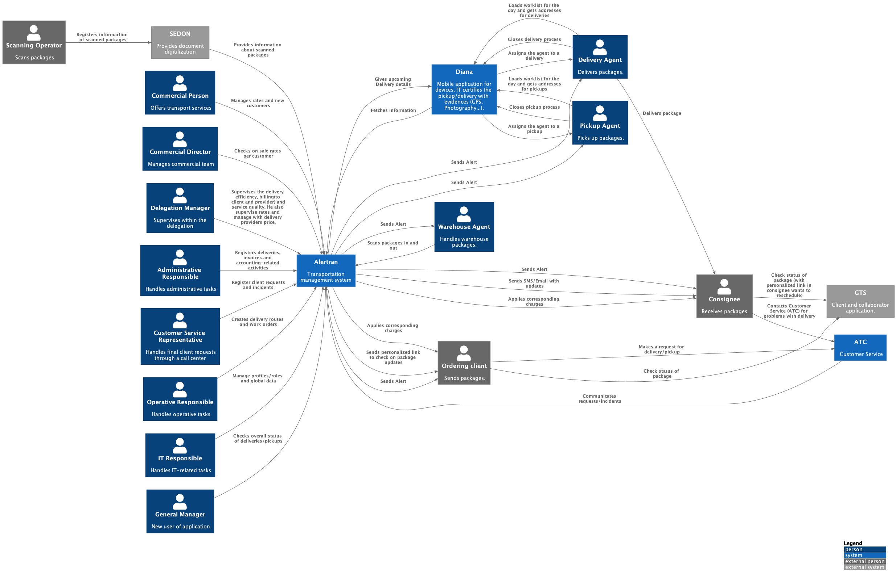
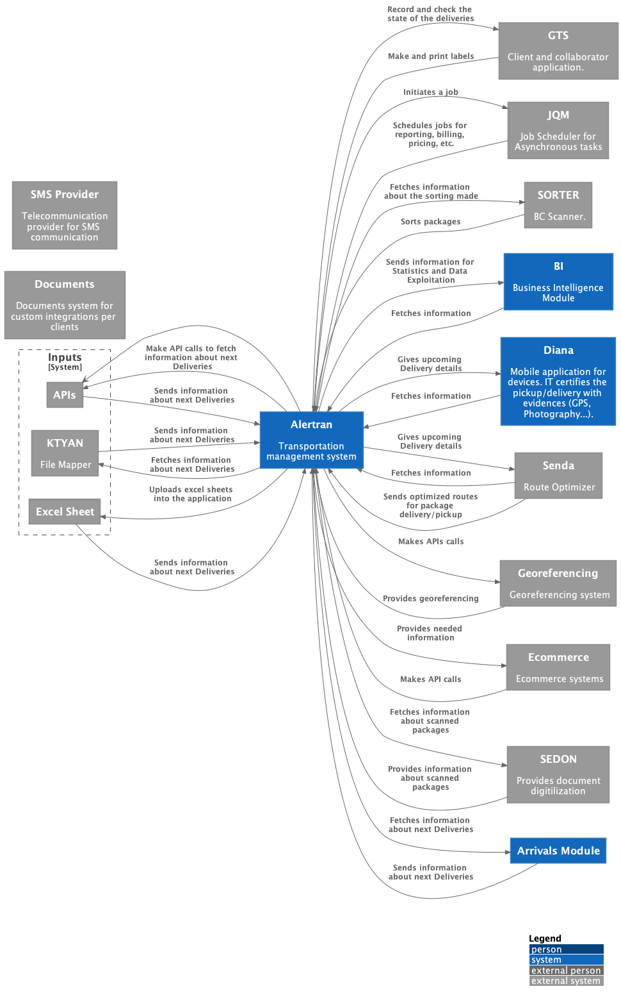

--8<-- "includes/abbreviations.md"

The system context has been split between the "People" and the "External systems" that interact with Alertran TMS. [You can check the whole System Context Diagram here.](system-context.png){: .hide-on-pdf }

### People System Context
This first diagram below illustrates the interaction between the application and its different users along all modules.
The external users are those who do not have direct access to the application such as the "ordering client" who initiates a pickup/delivery order and the "consignee" who receives the final pickup/delivery service.
The internal users are those who actually use the application in order to carry on certain activities. Depending on the user´s role, he/she can handle different modules:

- On a commercial level: The commercial person and the commercial director mainly handle the commercial module because they are both responsible of handling new clients and managing their corresponding rates, although they can have different responsibilities based on the level of hierarchy
- On a delegation level: The delegation manager handles the delivery efficiency, billing(to client and provider) and service quality on a delegation level
- On an admistrative level: the admistrative responsible of registering deliveries/pickups, invoices and billing-related tasks
- On an IT level: the IT responsible of setting user profiles and roles
- On a Customer Experience level: the Customer Service respresentative responsible of registering client claims and requests
- On a Operative level: the operative responsible of creating delivery/pickup routes and work orders
- On an overall level: The general manager responsible of overall status of deliveries/pickups

### External System Context
The second diagram below illustrates the interaction between the application and the other internal/external systems.
The input systems are those considered as points of entry for the application in order to carry on pick-up/delivery activities.
Some systems are considered as enhancers for the efficient functioning of the application such as SENDA for route optimization, DIANA for mobility, SEDON for document digitalization, SORTER for package sorting, GTS for client collaboration, and georeferencing for correct positioning.
In terms of application information, Ecommerce systems help with its availability on platforms whereas the BI system help with its usage for statistics and data exploitation.
In terms of scheduling, the JQM systems handles heavy asynchronous tasks initiated by the application.
The SMS Provider as an external system serves as a communication mean with consignees by sending them an SMS with packages status.
There a Documents system as well that helps in customizing integrations per customer.

