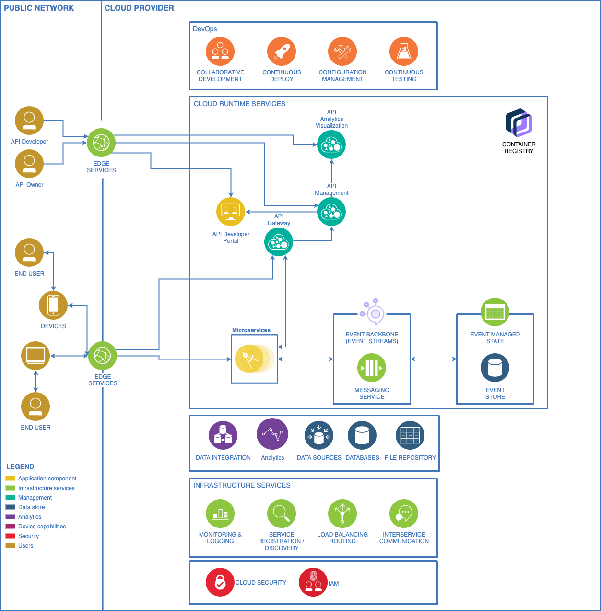
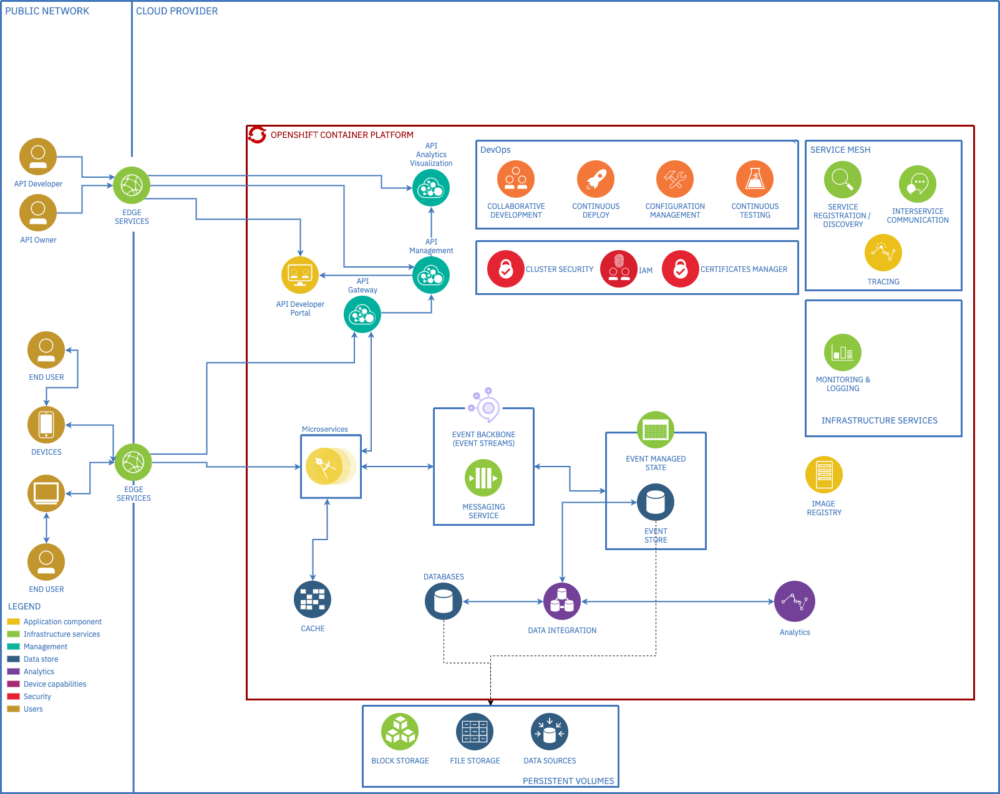
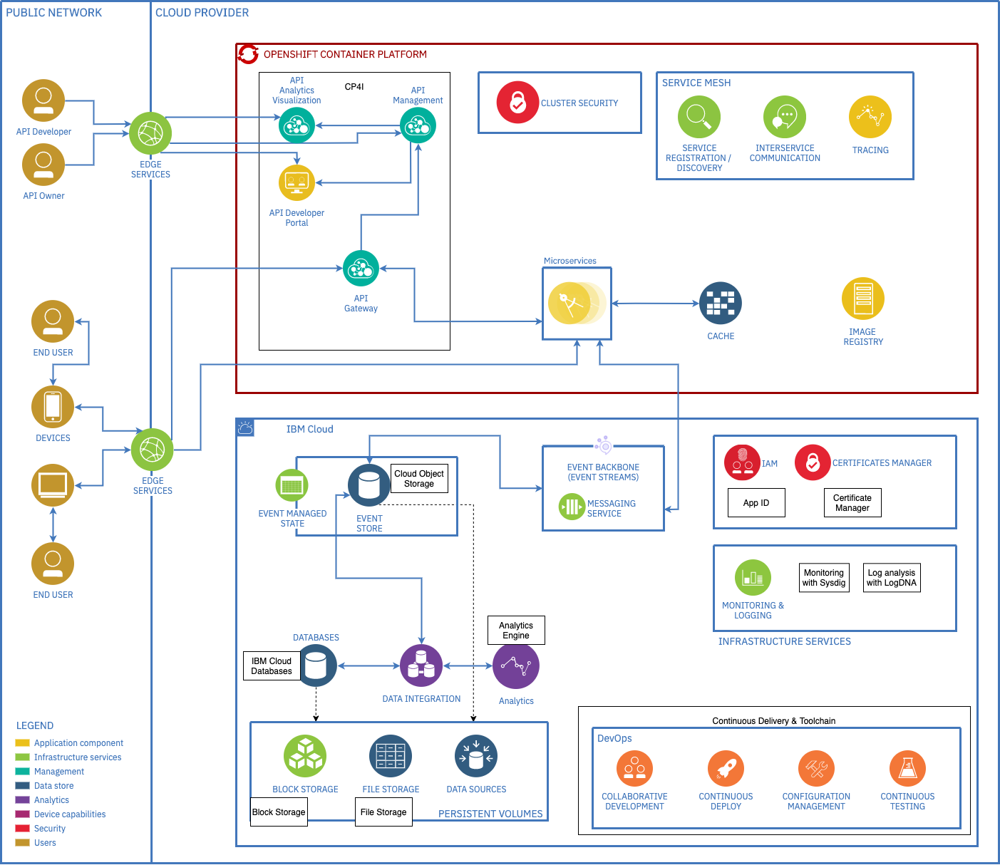

# 4.6 System View

The diagrams below provide an overview of what the system would look like based on the decided architecture.
As it is shown, there would be a set of DevOps services, Cloud runtime services, infrastructure services and security services, all based on a microservices architecture, where services are accessed through a API layer that would be managed and published through a Developer portal.
It is an event-driven architecture that responds to event streams communicated by a messaging service and stored and managed throughout its state.
In terms of security, roles and users would be defined through an IAM service and cloud security would be defined as part of the cloud provider services.

## 4.6.1 Architecture To-Be - System View - Based on Public Cloud Runtime Services

The following diagram represents the general proposed architecture based on Public Cloud Runtime Services. It assumes seperate suscriptions to each proposed service.

## 4.6.2 Architecture To-Be - System View - Based on OpenShift Container Platform

The following diagram represents the proposed architecture within an OpenShift Container platform.

## 4.6.3 Architecture To-Be - System View - Hybrid OCP + Cloud SaaS/PaaS Architecture

The following diagram represents the proposed architecture based on Hybrid OCP with a Cloud SaaS/PaaS architecture.

