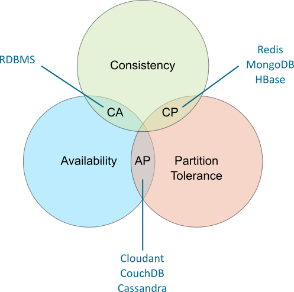

# Database type recommendations

Using persistence layers for microservices often means using a Database system to store data of the microservice (the "state" in a "stateless" application).

There are 2 main different database types when choosing a database for a microservice: Relational (SQL) and NoSQL databases.

## Relational Databases

Relational databases arrange data in tables that could be connected or related by common fields, separated from applications, and queried with SQL. In other words, the relational database placed data into tables, and SQL created an interface for interacting with it.

Relational databases and SQL work well for large servers and storage mediums if data schema don't have changes among objects on the database.

The key to the relational model is abstracting data as a set of tuples organized into relations, which allows for abstraction over the physical representation of data and access paths. While SQL is not the only possible language for implementing query over the relational model—in fact it does not conform strictly to Codd's original design—it's by far the most popular.

## NoSQL Databases

NoSQL, which stands for "not only SQL," is an approach to database design that provides flexible schemas for the storage and retrieval of data beyond the traditional table structures found in relational databases.

NoSQL databases are built for specific data models and have flexible schemas that allow programmers to create and manage modern applications. NoSQL is also more agile because it’s not built on the concept of tables and does not use SQL to manipulate or analyze data (although some NoSQL databases may have SQL-inspired query language).

NoSQL encompasses structured data (code in a specific format, written in such a way that search engines understand it), semi-structured data (data that contains tags or other markers to separate semantic elements and enforce hierarchies of records and fields within the data), unstructured data (information that either does not have a pre-defined data model or is not organized in a pre-defined manner), and polymorphic data (data that can be transformed to any distinct data type as required).

### NoSQL Landscape

|Database Type|Examples|When best used|
|-------------|--------|--------------|
|Key-Value|Compose for Redis, Memcached, Amazon DynamoDB|Storing interaction data, user preferences, simple shopping carts.  Not great at set operations.||
|Document|Cloudant, Compose for MongoDB|Event logging, content management, analytics.  Not great at complex queries.|
|Column-Family|Cassandra, Db2 Warehouse|Event logging, counters, blogs.  Not compatible with ACID transactions.|
|Graph|GraphDB, Compose for JanusGraph, Neo4J, OrientDB|Social Networks, Location-based Services.  Not optimal for certain types of bulk updates.|

## The CAP theorem

In the CAP theorem you have three properties: Consistency, Availability and Partition Tolerance. Any database can only guarantee two of the three properties.

**Consistency**

Consistency means that all clients see the same data at the same time, no matter which node they connect to. For this to happen, whenever data is written to one node, it must be instantly forwarded or replicated to all the other nodes in the system before the write is deemed ‘successful.’

**Availability**

Availability means that any client making a request for data gets a response, even if one or more nodes are down. Another way to state this: all working nodes in the distributed system return a valid response for any request, without exception.

**Partition tolerance**

A partition is a communications break within a distributed system, a lost or temporarily delayed connection between two nodes. Partition tolerance means that the cluster must continue to work despite any number of communication breakdowns between nodes in the system.

**Classification**:

- **CP database**: A CP database delivers consistency and partition tolerance at the expense of availability. When a partition occurs between any two nodes, the system has to shut down the non-consistent node (i.e., make it unavailable) until the partition is resolved. *Redis*, *MongoDB* and *HBase* are in this category.
- **AP database**: An AP database delivers availability and partition tolerance at the expense of consistency. When a partition occurs, all nodes remain available but those at the wrong end of a partition might return an older version of data than others (when the partition is resolved, the AP databases typically resync the nodes to repair all inconsistencies in the system). *Cloudant*, *CouchDB* and *Cassandra* are in this category.
- **CA database**: A CA database delivers consistency and availability across all nodes. It can’t do this if there is a partition between any two nodes in the system, however, and therefore can’t deliver fault tolerance. Any *RDBMS* are in this category.

## When to use each database type

Our recommendation is to use Relational Databases if we know objects to be stored have the same schema for all the use cases our microservice is going to be used (for example, a Relational Database could be used for a Query Microservice on [CQRS EDA pattern](https://martinfowler.com/bliki/CQRS.html)). 

If a microservice needs to store different object properties based on microservice configuration, or same object types have different properties based on different use cases of the microservice, we recommend to use NoSQL Databases.

## More information:

- [SQL vs. NoSQL Databases: What's the Difference?](https://www.ibm.com/cloud/blog/sql-vs-nosql)
- [NoSQL Databases](https://www.ibm.com/cloud/learn/nosql-databases)
