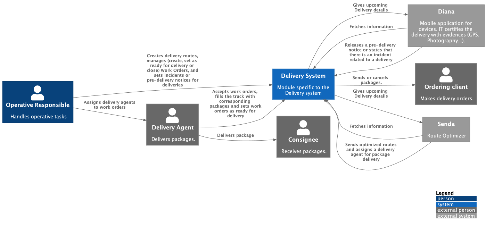
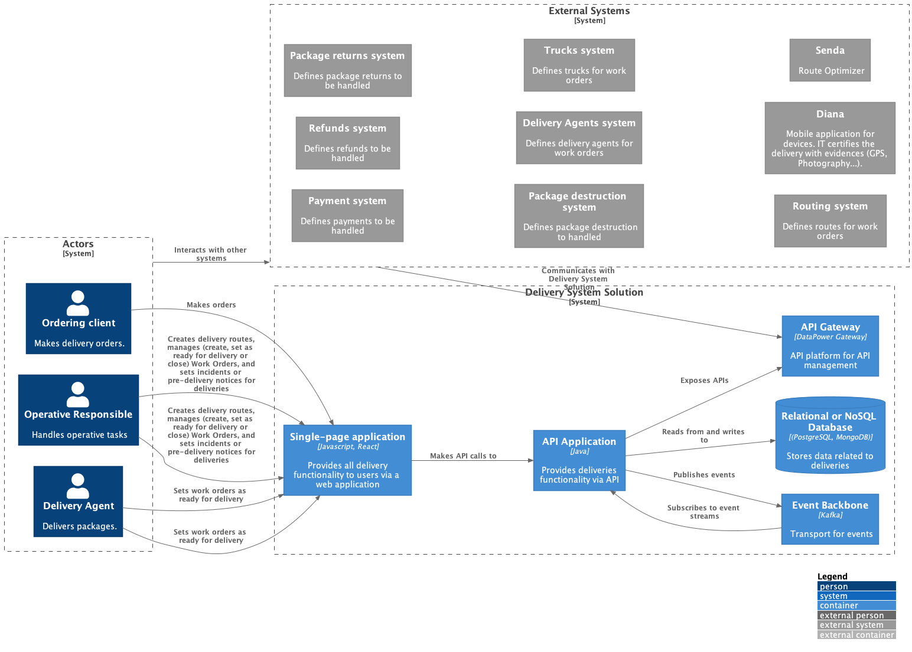
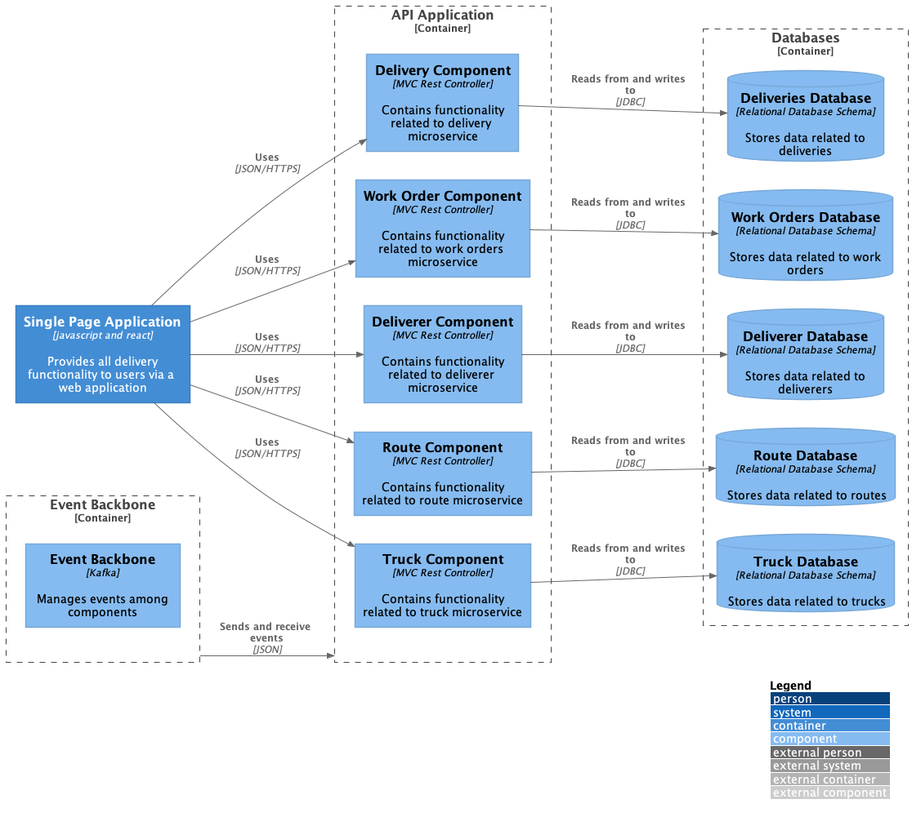
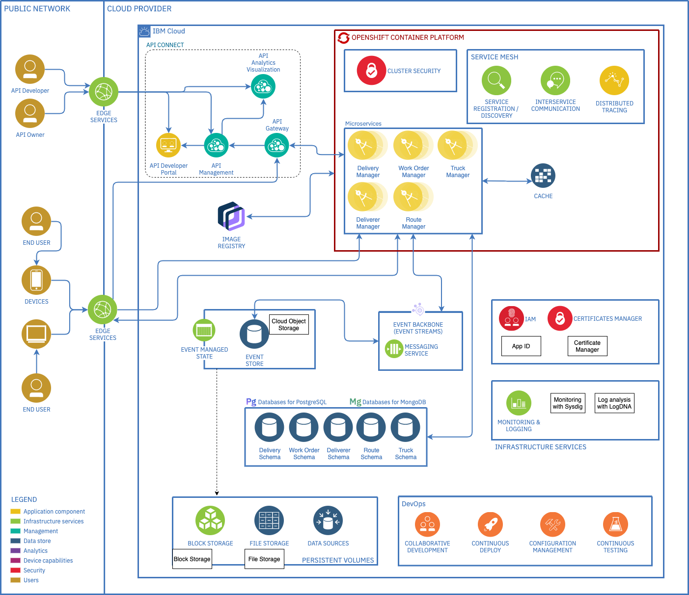

In order to visualize the proposed MVP architecture, the following diagrams illustrate the low level design of the level 1, level 2 and level 3 of the C4 Model:

### MVP System Context Diagram

### MVP Container Diagram

* Integration with 3rd parties and legacy system can be done using API Connect flows: IBM API Connect is a complete, intuitive and scalable API platform that lets you create, securely expose, manage and monetize APIs across clouds.

### MVP Component Diagram

### MVP System View

Reflecting the architectural decision and component model, this is the system view for the MVP to understand the "bigger picture".

